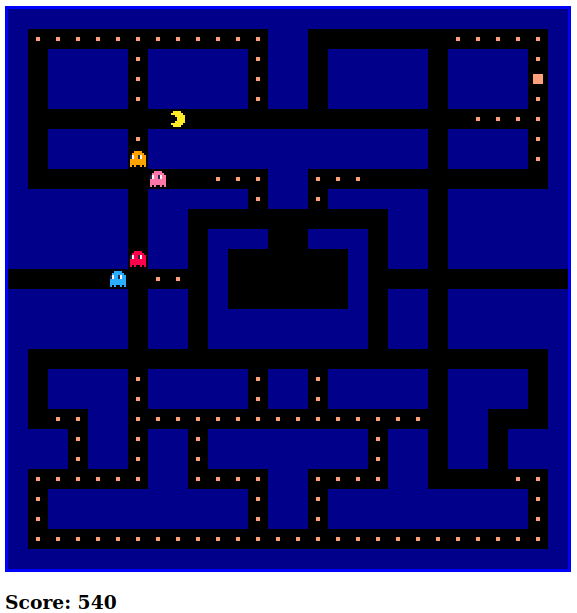
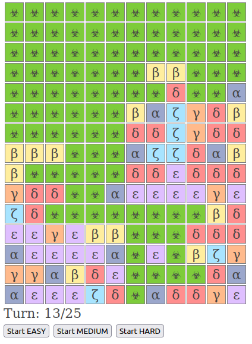

Javascript Assorted code
========================

Miscellaneous Javascript code snippets and experiments.

## Running

Usually, simply open `index.html` with a web browser

## Contents

### Games-related

* `\pac-man`:  A [Pac-Man](https://en.wikipedia.org/wiki/Pac-Man) clone, based on a tutorial but with a few graphics & AI improvements. Ghost AI is still dumb, but at least now they try to get out of the lair and don't enter back. Play it [here](https://kartones.net/demos/025/).

* `\barcode-wars` : Barcode Wars is a tiny javascript game for Firefox or Chrome that allows to read a barcode and play a small turn-based battle with an enemy, both generated based on the barcode. More info can be found [here](https://blog.kartones.net/post/barcode-wars-small-javascript-game/)  and you can play the game [here](https://kartones.net/demos/017/).

* `\the-plague` : Small Javascript & HTML5 game in which you are a plague that has to infect all cells before dying. Play it [here](https://kartones.net/demos/018/).

### Miscellaneous

* `\pubsub-modules` : Micro-framework built to prepare a small module-based architecture for Javascript, using pub-sub pattern. Includes two sample modules to test the FW capabilities. Just the very basic functionality, nothing advanced.
* `circle_points.html` : Small sample to remember how to distribute points inside a circumference.
* `NoCSS.js` : Small snippet I built to clear pages from CSS styles, Javascript, Blogger iframes and similar stuff and focus on reading the content. Ready to use as a bookmarklet in Firefox/Chrome.
* `madivachallenge.appspot.com.js` : Solution to first challenge of the Madiva challenge. If I have time I might do the rest.
