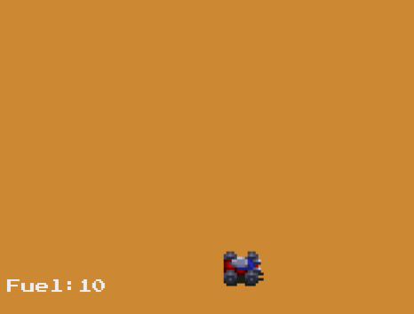

# Robot Exercise

## Intro

A classic coding exercise, solved in Javascript, and with a web graphical version to make things more fun.

Check the `robot-01.mjs`, `robot-02.mjs` & `robot-03.mjs` source code files for additional details and the description of each exercise step.

## Setup

- [NodeJS](https://nodejs.org) (tested on v18) + `node exercise.mjs`
- [http-server](https://www.npmjs.com/package/http-server) for the web version